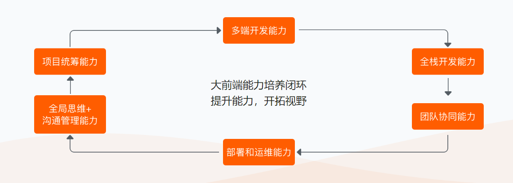
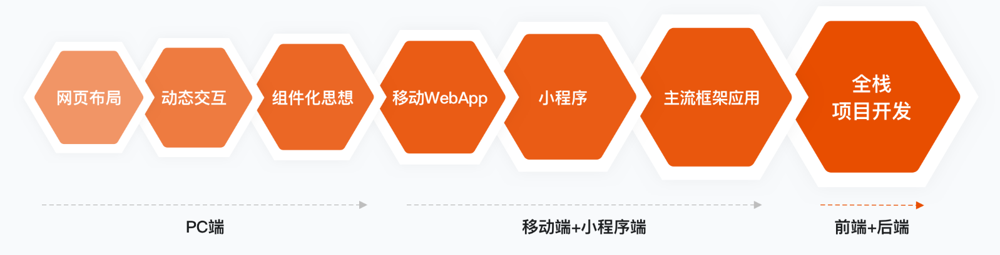
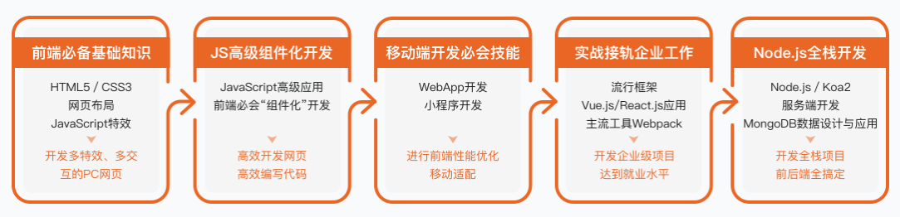
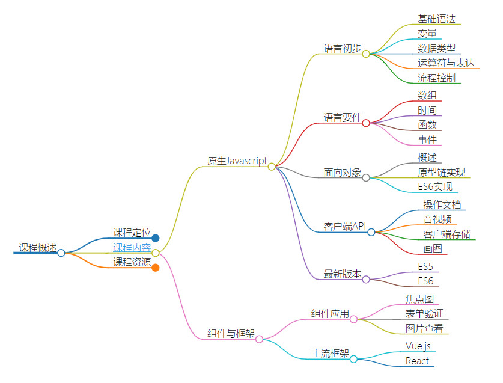

# 课程概述

## 课程定位

> 软件技术专业四大方向-**前端开发**方向
>
> 前端开发方向课程体系-**承上启下**作用

### 专业方向

**软件开发领域**包括**前端开发**、**后端开发**、**移动开发**、**数据库开发**等，软件技术专业重点选择**前端开发**(包括移动开发在内的多端开发)、**后端开发**两个方向，鉴于虚拟现实的流行性特别把**虚拟现实**作为一个方向，另外**测试运维**也是一个方向。

- **前端开发**:star:
  - 多端开发
    - PC开发
    - APP开发
    - 小程序开发
  - 全栈开发
- 后端开发
- 虚拟现实
- 测试运维

### 工作流程

我们依据前端开发工作流程来安排课程体系，依据这个体系来逐步学习前端开发。

- 网页布局
- **动态交互**:star:
- **组件化思想**:star:
- 移动APP
- 小程序
- 主流框架
- 全栈开发

### 课程体系

- 原型设计
- 前端开发
- **交互开发**:star:
- 混合式APP开发
- 微信开发

我们可以看到**交互开发**在**前端开发课程体系**中起到承前启后的作用。

## 课程内容

交互开发课程旨在培养学生前端开发技能栈的交互开发能力，围绕交互开发主流技术展开教学，主要分为**原生Javascript**和**组件与框架**两个部分，具体如下图所说。

1. 原生Javascript
   1. 语言初步
      2. 基础语法
      2. 变量
      3. 数据类型
      4. 运算符与表达
      5. 流程控制
   2. 语言要件
      1. 数组
      2. 时间
      3. 函数
      4. 事件
   3. 面向对象
      1. 概述
      2. 原型链实现
      3. ES6实现
   4. 客户端API
      1. 操作文档
      2. 音视频
      3. 客户端存储
      4. 画图
   5. 最新版本
      1. ES6
      2. ES7
2. 组件与框架
   1. 组件应用
      1. 焦点图
      2. 表单验证
      3. 图片查看
   2. 主流框架
      1. Vue.js
      2. React

## 课程资源

- 教程

  - [视频教程](https://search.bilibili.com/all?keyword=javascript)

  - [阮一峰 JavaScript 标准参考教程](https://javascript.ruanyifeng.com/)

  - [MDN Javascript文档](https://developer.mozilla.org/zh-CN/docs/Web/JavaScript)

  - [Github课程网站](https://zptcsoft.github.io/js/)
  - [You-Dont-Know-JS](https://github.com/getify/You-Dont-Know-JS)
  - [Awesome-javascript](https://github.com/sorrycc/awesome-javascript)

- 规范

  - [JavaScript The Right Way中文版](http://jstherightway.org/zh-cn/)

  - [JavaScript 风格指南](https://lin-123.github.io/javascript/)

  - [Best of Javascript](https://bestofjs.org/)

  - [2019年Javascript明星项目](https://risingstars.js.org/2019/zh)

- 原生

  - [You Don't Need jQuery](https://github.com/nefe/You-Dont-Need-jQuery/blob/master/README.zh-CN.md)

  - [You Might Not Need jQuery](http://youmightnotneedjquery.com/)

  - [Plain JS-使用原生JS](https://plainjs.com/)

- 广场

  - [codepen](http://codepen.io/)
  - [codrops](https://tympanus.net/codrops/)
  - [littlesnippets](https://littlesnippets.net/)
  
- 面试

  - [JavaScript 进阶问题列表](https://github.com/lydiahallie/javascript-questions/blob/master/zh-CN/README-zh_CN.md)
  - [FE-Interview](https://github.com/lgwebdream/FE-Interview)
  - [Fe-interview](https://github.com/haizlin/fe-interview)
