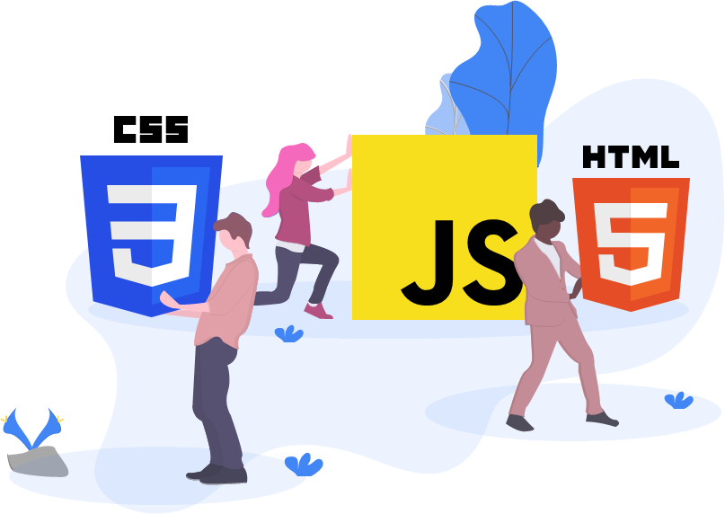
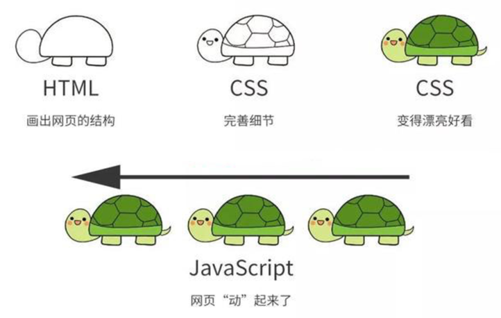

# Javascript概述

## Javascript介绍



Javascript是一门**解释型**脚本语言，是网页三剑客（HTML、CSS、Javascript)之一。

- HTML 实现网页内容
- CSS 实现网页布局
- Javascript实现网页交互



那么Javascript到底在网页中可以起到什么作用呢，让我们来看个例子。

假设我们的网页中有个按钮，我们用HTML实现按钮，用CSS美化按钮，如下代码所示。

```html
<!-- HTML实现按钮 -->
<button class="btn">单击按钮，打个招呼！</button>
```

```css
/* CSS实现样式 */
.btn{
	padding: 16px;
	background-color: aliceblue;
	border-radius: 10px;
	color: #000;
	font-size: 1.5;
}
```


